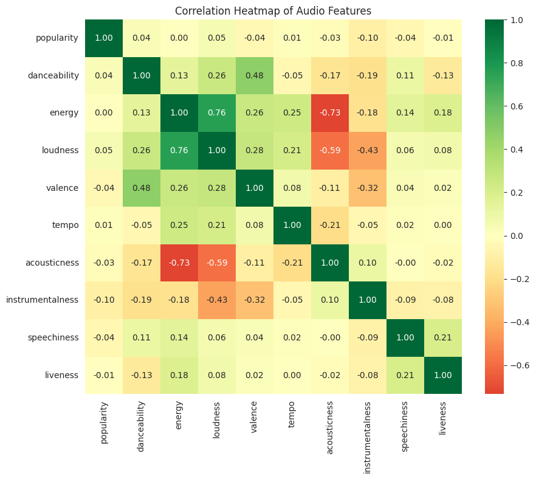
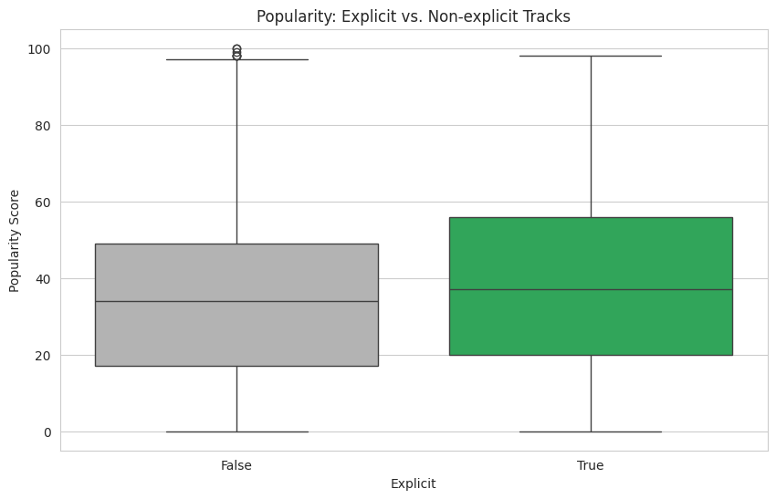
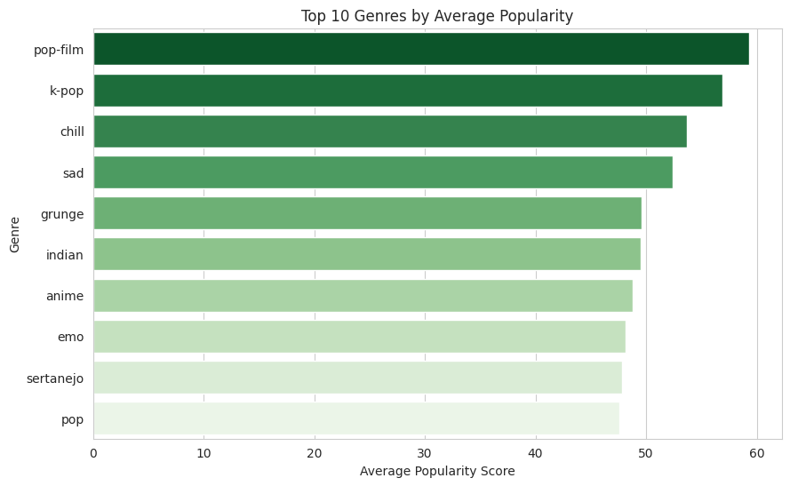

# Spotify Track Popularity Analysis

Statistical and predictive analysis of Spotify track popularity using Python.

## Project Overview

This course project investigates the factors influencing Spotify track popularity using a dataset of approximately 114,000 tracks across 114 genres.

## Objectives

- Explore the general characteristics of Spotify tracks
- Examine relationships between audio features and track popularity
- Test differences in popularity between explicit and non-explicit tracks
- Examine differences in popularity across genres
- Build a multiple linear regression model to predict track popularity

## Methods

- Descriptive Statistics
- Exploratory Data Analysis (EDA)
- Correlation Analysis
- Multiple Linear Regression
- Independent Samples T-Test
- One-Way ANOVA

## Tools

- Python
- Pandas
- NumPy
- Matplotlib
- Seaborn
- SciPy
- Statsmodels

## Key Findings

- Audio features alone explain only a small proportion of the variation in track popularity, with the regression model achieving an R² of approximately 1–2%.
- Explicit content is statistically associated with differences in track popularity based on an independent samples t-test.
- Track popularity differs significantly across music genres based on a one-way ANOVA.
- The findings suggest that technical audio characteristics alone are weak predictors of popularity, while genre and other external factors may play a more important role.

## Business Implications

- Spotify-style recommendation and content strategies should not rely solely on audio features when assessing potential track popularity.
- Genre-level differences may provide useful context for understanding audience preferences.
- The analysis demonstrates how statistical testing and regression can support data-driven decision-making.

## Visualizations

### Correlation Heatmap



### Explicit vs Non-Explicit Tracks



### Top 10 Genres by Average Popularity



## Project Structure

```text
spotify-track-analysis/
├── README.md
├── .gitignore
└── spotify-track-popularity-statistical-analysis.ipynb
